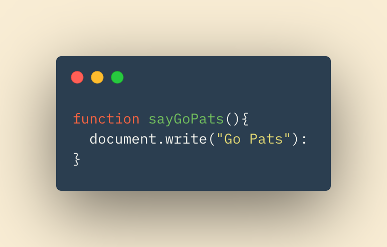
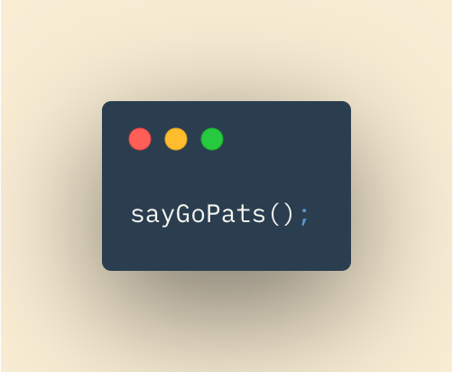

# Programming With Javascript

Javscript allows us to add functionality to our previously structured (with HTML) and styled (with CSS) webpages.

**Scripts** in Javascript follow our written instructions.  They will do exactly, and only, as we say.  We will look at how these instructions are written, what makes them up, and it what ways they can be done.  

## In This Article:

[Scripts](#scripts)

[Vocab](#vocab)

[Think programmatically](#think)

[Functions](#functions)

## What and How of Scripts

No, this isn't your high school musical script.  JS (Javascript) scripts are series of instructions.  Think of them as handbooks, recipes, or manuals for humans.  Script can be read from top to bottom, by the computer, or referenced for a portion of the script.  Its useful to declare the blueprint of our script. Before writing it, we will:

1. Define the Goal - Make clear what we want our script to accomplish
2. Design the Script - Set an outline of needed variables and steps in our script
3. Code Each Step - Write the steps in a progamming language, in this case JS

## Vocabulary and Syntax

Just like the English language, progamming languages must abide by vocabulary and syntax rules.

* **Vocabulary** - Words the computer understands
* **Syntax** - Rules for how those words and symbols can be used together

## Think Programmatically

With pracitice, you will begin to think like a computer.  Step-by-step, line-by-line.  Flow charts and logic models can help with this process.  They can give visuals for us to help plan the computers flow and the scripts functionality. 

## Expression & Operators

**Expressions** evaluate into single results or values.  Declaring a variable as such is an expression that utilizes a single variable:

> var months = 12;

Another expression could use two or more variables:

> var area = 7 * 6;

**Operators**

Operators are used (and essential) in expressions.  You have already seen operators and haven't known it!

* *Assignment*
> =

* *logical*
> &&

* **arithmetic**
> +, -, *

## Functions

Functions let you group a series of statements toget to be performed to complete a specific task.  Making a function saves time as each time you need that function (and everything it does) you only need to call the function with a few characters.  The alternative would be to write out potentially dozens of lines of code *each* and *every* time you want those instructions to run.

Functions are first declared with the keyword 'function' followed by the name of the function you'd like to create.

In the example above, our function name would be 'sayGoPats'.

Inside the curly brackets we can put the instructions we would like our function to perform.  In this case it will print "Go Pats" to our document.

Now that our function is declared, we can call the function anywhere in our program, with a simple line as follows:

We can call this function once, ten times, or a hundred times.  

~ QP3

[Home](../README.md)