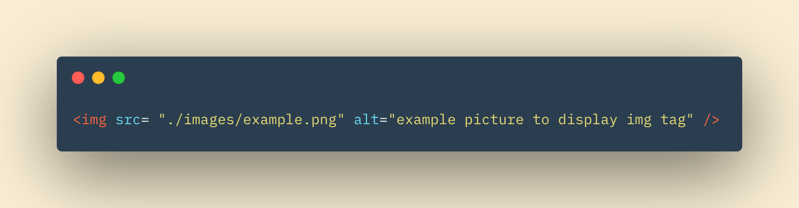

# HTML Images, CSS Color & Text

## In this Article

[Images](#topic1)

[Color](#topic2)

[Text](#topic3)

[JPEG PNG GIF](#topic4)
---

## Images

Imaged are a great way to add life to your web page. Your image might be a picture related to your topic, an informational graphic, or of a table showing data. Images should be relevant to your page, fit aesthetically, and be recognisable.  

When adding images to a project, it's best to have an "images" subfolder in the project.  Any image file you'd like to use can then be stored in this folder and accessed via relative URLs from your project. 

### Adding Images with IMG Tag

Images are added with the < img > element.  The < img > element is an empty element, meaning it has no closing tag. Attributes about the image sit inside the tag.  The **src** and **alt** attibutes are a must, at a minimum. 

An example of an image tag is below.  Notice how we are using the src and alt attributes. 

The **src** attribute tells the relative URL to the file location.  The **alt** attribute gives a brief description of the image. Should the file not be displayed properly, the description would show in it's place.

### 3 Ruls for Creating Images

1. Save as correct format (PNG, JPEG, GIF)

2. Save image at correct size to fit your use on the page

3. Save image at correct resolution.  Resolution can affect load times and the web pages performance. 

## Color

## Text

## JPEG PNG GIF

~ QP3

[Home](../README.md)

Information put into my own words came from *Book Title* by J Duckett
