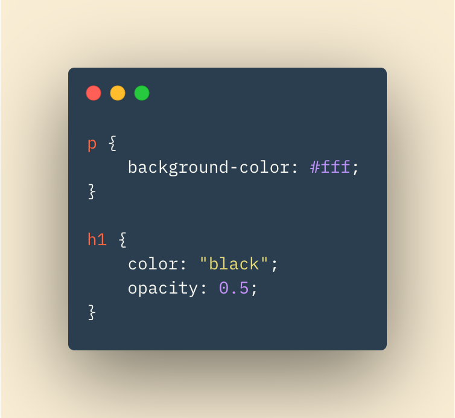

# HTML Images, CSS Color & Text

## In this Article

[Images](#topic1)

[Color](#topic2)

[Text](#topic3)

[JPEG PNG GIF](#topic4)

---

## Images

Imaged are a great way to add life to your web page. Your image might be a picture related to your topic, an informational graphic, or of a table showing data. Images should be relevant to your page, fit aesthetically, and be recognisable.  

When adding images to a project, it's best to have an "images" subfolder in the project.  Any image file you'd like to use can then be stored in this folder and accessed via relative URLs from your project. 

### Adding Images with IMG Tag

Images are added with the < img > element.  The < img > element is an empty element, meaning it has no closing tag. Attributes about the image sit inside the tag.  The **src** and **alt** attibutes are a must, at a minimum.

An example of an image tag is below.  Notice how we are using the src and alt attributes.

The **src** attribute tells the relative URL to the file location.  The **alt** attribute gives a brief description of the image. Should the file not be displayed properly, the description would show in it's place.

### 3 Rules for Creating Images

1. Save as correct format (PNG, JPEG, GIF)

2. Save image at correct size to fit your use on the page

3. Save image at correct resolution.  Resolution can affect load times and the web pages performance. 

---

## Color

The right color can make a bedroom a warm, comfortable place to be.  It can also make it a eye-torture room.  The same holds true for our webpages!  We can use CSS to asign any kind of color and color-scheme for our pages.  We give color to via color valuse in our CSS. 

* *RGB Values* - Values for red green and blue, each between 0 and 255.

* *HEX Codes* - Hexadecimal code can be used for the same RGB values

* *Color Name* - A limited amount of colors can be given by their name

**Contrast** and **opacity** values can also be given to our elements and colors. High contrast makes text easier to see against it's background. If reading for long periods of time, however, a lower contrast will be easier on the eyes.  Below is an example of our CSS passing some of these discussed properties to elements of a webpage. 

---

## Text

Text can be styled in different ways, similar to how your word processor allows you to change font styles. We can change font styles, font families, font sizes, bold fonts, and italicize fonts.

Additional font styling techniques include underlining font, strikethrough font, aligning font to the left center or right.

### Pseudo Classes

Three pseudo exist.  The **Pseudo** classes are are hover, active, and focus.

* :hover - Styles applied when user hovers over the element

* :active - Styles applied when element is being activated

* :focus - Styles applied when an element has focus.  Any element that is interacted with can have focus. 

---

## JPEG PNG GIF

Images can come in varying file types. Depending on the use of the image, different formats will be better or worse to use.  

* **JPEG** - Best for use with natural scenery or photography with variations in color

* **PNG** - Photos that need transparancy or objects with sharp edges

* **GIF** - Format for images that contain animations

Choosing the correct format can also help page performance.  Formats and compression of a file can affect the image size.  For example, a PNG file does not lose any data during compression. As a result, a PNG file would be of higher quality but also take up more disk space.  These are the tradeoffs we must take into consideration when choosing file types!

~ QP3

[Home](../README.md)

Information put into my own words came from *HTML & CSS* by J Duckett and *JPEG vs PNG vs GIF* by Rahul Nanwani
