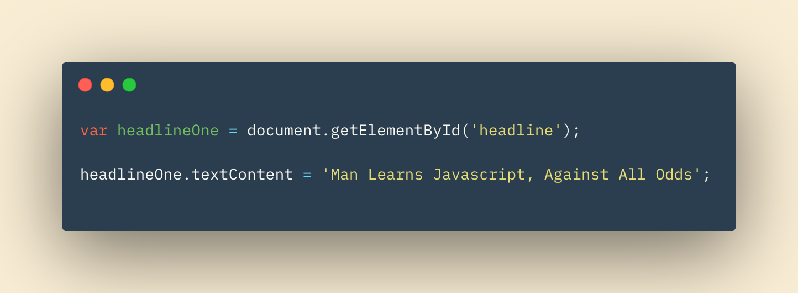

# Problem Domain, Object Literal, and the DOM

## In this Article

[Problem Domain](#topic1)

[Object Literal](#topic2)

[Topic 3](#topic3)

---

## Problem Domain

The articles autho, John Sonmez, says that the answer to many peoples question of "What is the hardest part of programming?" is learning the problem domain.  

He compares the progamming to putting together a jigsaw puzzle.  A jigsaw puzzle where you can't entirely picture the end result is difficult, it's abstract.  Writing a big enough program is similar.  Sometimes we know major components and this makes it easier to build and work from reference of what we have.  Sometimes, especially in the "real world", we are not given the full picture of what our end goal looks like.  This create an abstract problem domain, much like our difficult jigsaw puzzle, that be can be very difficult to navigate!

### Proposed Solutions

The author recommends two solutions when dealing with difficult problem domains.  

1. Make the problem domain easier

The problem can be made easier by breaking down the larger problem into smaller problems.  Deal with a single chunk of a problem and slowly build.  I would compare this to first finding your corner pieces in your jigsaw puzzle.  Start from the corners and build out. 

2. Get bett at understanding the problem domain

The second proposed solution is to get better at solving the problem domain (duh). It's not always that simple, and I imagine experience helps a lot here.  Take time to talk through the problem with your peers, the customer, or even on your own terms.  Taking the extra step to really understand the situation can pay serious dividends here.  Identify your problem, plan out your rhythmic attack, and execute.  

## The Object Literal

An **object** is a programming technique to group together variables and functions into one working unit.  Objects can then be used to model real world "things".  For example, we could have an object that represents an American Football player.  Our model of this player might need to have a position, a height and weight, and a general speed level at their position.  

**Properties** are what variables become when they belong to an object.  **Methods** are what functions become.  Our football player may have the function sprint(), which could return a 40 yard dash time based on their speed.  Below is a snippet as an ecxample of how we would declare an object using **literal notation**.

Objects use **key** / **value** pairs.  In our example above *name*, *position*, *age*, *speed*, and *run* would all be keys.  Their corresponding values are the values on the opposing side of their colons (*PlayerA*, *RB*, *28*, *90*, and *function...* respectively)

## Document Object Model

When an HTML page is loaded, your browser creates a model of the page in memory.  This model is made up of objects (hence the name *document object model*). The objects allow the page to be manipulated and changed after it is loaded, and how those effects should be displayed to the user. 

The **DOM Tree** is model of the webpage.  Nodes on the tree respresent the web page and each element on the page.  We can access these elements through the initial node, the **document** node. Through this node each element and content of those elements is accessible.  We can manipualate any element on the page by :

1. Locating the node that respresents our element

2. Work with the elements to change its content, text, or attribute values

Below is an example of how to use javascript to access an element, and change it's text.

~ QP3

[Home](../README.md)

Information put into my own words came from *Javascript & JQuery* by J Duckett and *Understanding the Problem Domain Is The Hardest Part of Programming* by John Sonmez.
