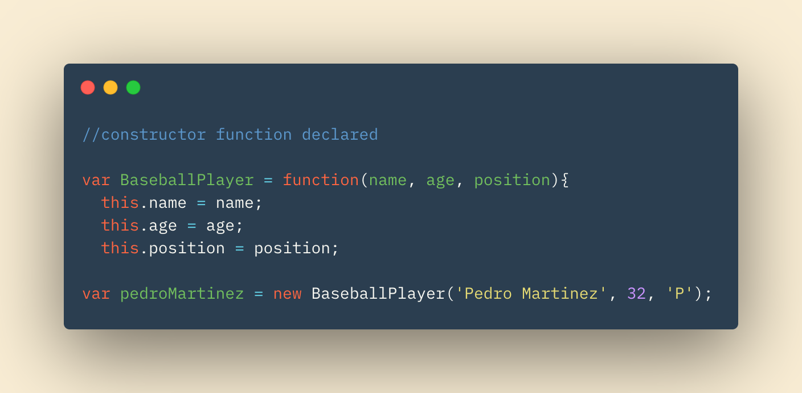

# Oobject Oriented Programming & HTML Tables

## In this Article

[Domain Modeling](#topic1)

[Tables](#topic2)

[Functions](#topic3)

---

## Object Oriented Programming

**Domain Modeling** is essentially creating a model of a real world problem in our code.  In code, this practice is commonly known as *object oriented programming*.  We use objects in code to store and contain values (properties and methods).  These objects can then be used in our models to represent the "real world", or otherwise conceptual, models.

Objects can be created using *constructore functions*.  These functions can have properties and methods "attached" to them. When an object is made using the constructor, arguments are passed which specify that specific objects values for it's respective properties.

Our constructor functino above is BaseballPlayer.  When called, we can pass arguments to the function and assign this to a variable named of our choosing. This variable is now our object with properties set to our passed in argument values. 

---
 

## Tables

Whether your local newspaper, crypto-currency app, or HTML page, tables are effective ways to portray data.  

Tables in HTMl are declared witht he < table > element.  Headers and cells can be identified by your document with the < th > and < td > respectively.  These headers and cells will sit inside of our < td > element, which represents a single row of our table.

Our tables can be styled with borders and backgrounds, similar to other elements in our documents.

---

## Functions

~ QP3

[Home](../README.md)

Information put into my own words came from *Book Title* by J Duckett
