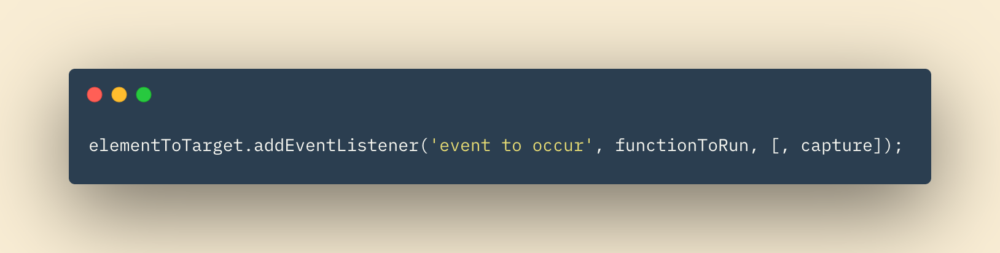

# Forms and Events

## In this Article

[Forms](#topic1)

[Lists & Tables](#topic2)

[Events](#topic3)

---

## Forms

**Forms** serve many purposes on our web page.  A form can be uesed to search for something that the user specifies, are they can be used to register a personal email to get notifications, or when you might create an account to become a validated member of a particular service.

Forms can include single line text entries, multi-line text entries, drop-down choices, radio button choices, or form submission buttons, among others.

### Form Flow

1. User selects or inputs data

2. Name of form control and values are sent to server upon user submission

3. The server processes the information

4. A new webpage or element is sent in return to be displayed to the user. 

The data is sent to the server usign name/value pairs.

### Form Structure

Form controls live inside of a form element. Action attributes are attached to each form element that hold a URL for the page on the server that receives the user inputted data upon submission.

---

## Lists & Tables

Lists can be styled so the bullet-points flow with the webpage. Ordered lists can be styled so that the list items are labeld with numbers, roman numerals, or letters.

Tables can be styled as well. Table sizes, empty cell styling, letter spacing, font styles, background colors, and text transformation can all be customized with CSS. 

## Events

**Events** in the context of web development includes actions such as clicking on a link, hovering over an image, or typing on the keyboard.  We can write our javascript to run certain code, and even manipulate the DOM, when a given event occurs.

Some, but not all, types of events include:

* scroll - User scrolls up or down on page

* keypress - character is being inserted with keyboard

* click - User presses and releases the mouse button over an element

* dbclick - User presses and releases the mouse button twice over an element

### Event Listeners

**Event Listeners** are a common, recent technique to access events using our javascript.  The anatomy of an event listener is below.

~ QP3

[Home](../README.md)

Information put into my own words came from *Book Title* by J Duckett
