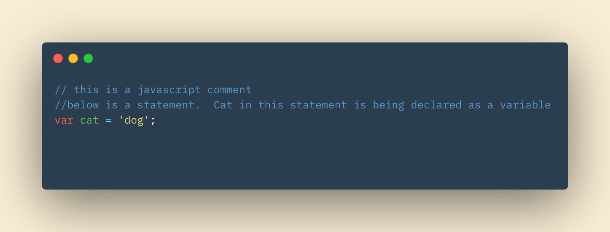
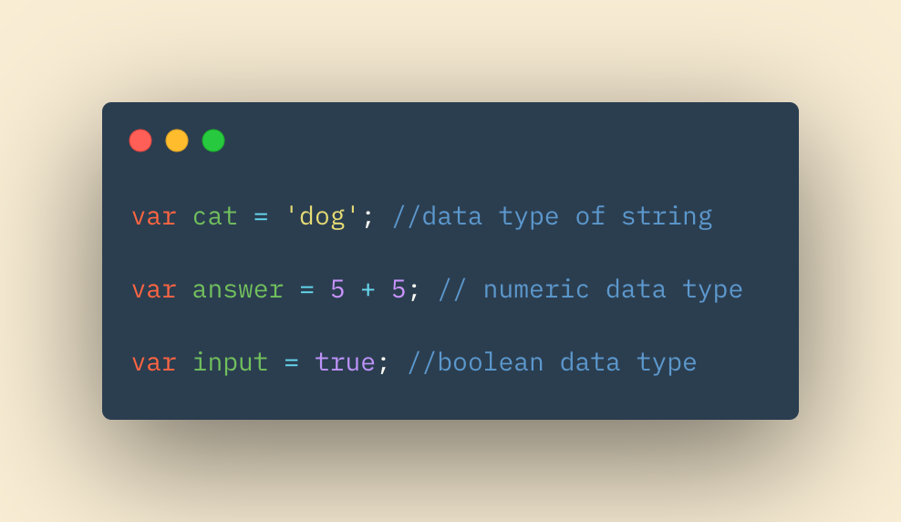
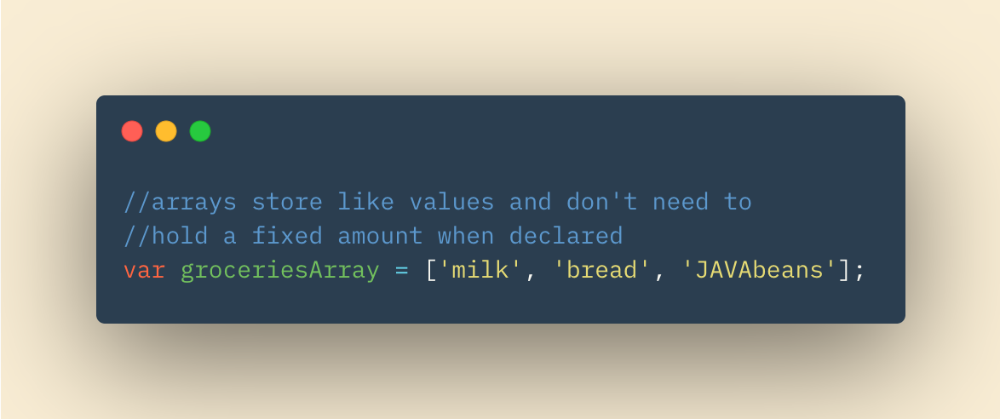
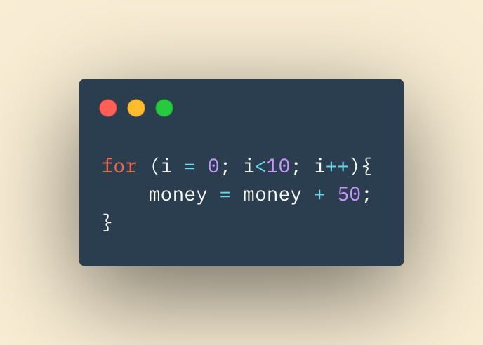
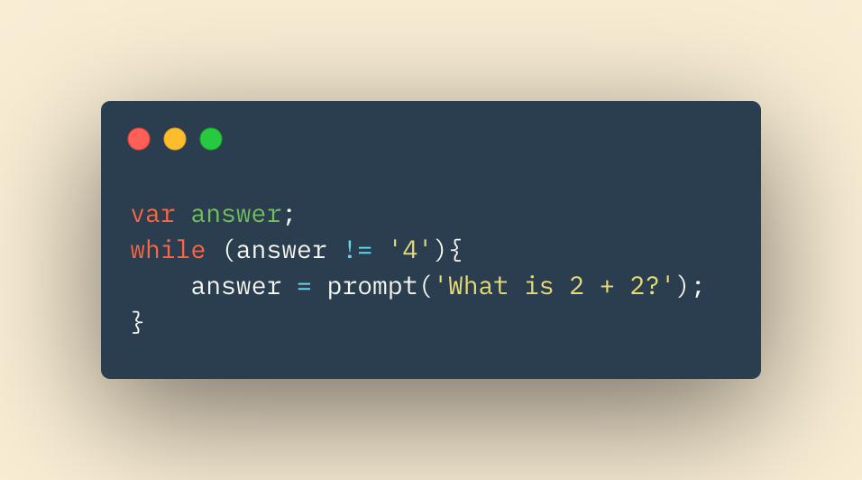

# Class-02 Reading Notes

## In This Article:

[Text in HTML](#text)

[CSS](#css)

[JavaSlipt..I mean Script](#javascript)

[Hula Loops](#loops)

---

## Text in HTML

Tags, known as *markup*, are used to display text on your created webpage.  Tags to display text include the **paragraph** tags, **heading** tags, **bold** tags, and *italic* tags.

Different text tags give *life* and *structure* to your webpage!  Use them creatively and they can be simple way to spruce up your text.  

### Semantic Markup

Certain text elements are used without the intention of affeting the overall structure of the webpage.  Their purpose, in addition to displaying text on the rendered page, is to add additional information to the page.  This information can then be used by screen reading or search engine programs.  

Examples of semantic markup include the **blockquote** tag, the **cite** tag, or an **address** tag.

---

## Introducing CSS

### Cascading Style Sheets

Another name for CSS could be Color Style and Shaping!  It's not though, so don't get confused.  That's just the gist of what CSS allows developers to do.  CSS can take an otherwise black and white webpage of text and turn it into a colorful, visually appealing webpage.  

### How of CSS

CSS works by treating every element, in our HTML document, as having a box around it.  Anothe way to conceptualize it is by imaging stacking Matryoshka dolls.  Each doll is its own container, but can sit inside a larger doll (or container).  In this analogy, each doll would be an element and would be treated as a container by CSS.  

When a rule is applied to an element via CSS, the rule applies to the elements (or containers) within the inital parent element (Unless otherwise specified, but let's not confuse ourselves too soon).

### Breaking Down CSS Further

A CSS file will contain essentially a list of rules.  Each rule will consist of a selector and declarations.  The selector, for now, will be selecting elements on our HTML page.  The declarations within a given selector will tell the HTML how to style those selected elements!  Let's look at an example.

In the css snippet above, we have 2 selectors.  Both getting their own set of rules.  The first selector, the **h1** is being given a background color of blue.  In this case, 'background-color' is known as a property.  "Blue" in this case is the value.  Property / Value combinations are essentially the rules that the selectors they belong to must abide by.  Any and all property / value combinations must exist within the curly braces that follow the selector. Each selector has it's own set of curly braces, and thus it's own set of rules.

The second selector we see is the **p** selector.  The **p** elements in the HTML file this CSS applies to will receive a background color of "red", as indicated by the property / value pair inside the **p** selectors curly braces.  While this may seem simple, it illustrates the power of CSS.  CSS allows us to declare differenty styling for different elements in our page.  The possibilities are endless!

Important tip for now is to not worry or become overburdened with understanding exactly how your computer knows what "red" means or what a "font-family" is.  Know and trust that your computer and web browser understand what to do with these phrases.  You can change font styles, colors, placement, and can even add borders and adjust positions on the page, all with CSS. Enjoy your time exploring the possiblities!

---

## Basic Javascript Instructions

Just like the English language, progamming languages must abide by vocabulary and syntax rules.

* **Vocabulary** - Words the computer understands
* **Syntax** - Rules for how those words and symbols can be used together

Combined with some building blocks we are about to go over and an understanding of javascripts vocabulary and syntax rules, we'll have the components necessary to read and write clean clode with javascript.  

Javascript code, also known as scripts, can be thought of as a series of instructions, akin to the cookbooks you might use in your kitchen.  A basic instruction is known as a statement. 

* **Statement** - An individual instruction in our code

> Tip: Always remember javascript is case sensitive.  "CAT" will not be read the same as "cat".

Comments in javascript are used similar to comments in an HTML file.  In javascript, they can be used to clarify code, or tell developers what a functions purpose is. Comment lines begin with double-forward slashes.

**Date Types** are an important concept in javascript. Just like you couldn't have a math equation that added oranges to the number 6, javascript can only do certian things with certain data types. 

Notice how each data type in the example above is being declared and stored by a variable!  Variables can be changed to store different values, hence the term *variable*.

If you want to be a developer or work with code, get close with the term **array**.  Arrays are special variables that can hold multiple values.  They are an incredibly powerful tool in javascript.

Values in arrays are indexed and accessed on a numerical system.  A key point to know is the index starts with '0', and counts up for each item in the array.  

---

## Hula Loops

Before discussing our loops, we must understand **evaluating conditions** and **logical operators**.

Conditions will always result to either **True** or **False**.  In other words, of type **Boolean**. To do these evaluations, we use the following syntex, among others.

> == (Equal to)

> != (Not Equal to)

> < (Less Than)

Logical operators allow us to compare the results of more than one condition.  

> && (Logical 'and')

> || (Logical 'or')

> ! (Logical 'not)

In order for a logical 'and' to evaluate to True, *both* conditions must evaluate to True, as in the example below>

> (5>2) && (5<10)

In an *or* logical operator, either condition can evaluate to True and the logical operator will return True.

---

## Loops

Loops check a condition. If the condition evaluates to True, then the loop will continue to cycle.  If and when the condition evaluates to False, the loop is exited and the code can continue.

### For Loop

The keyword in a for loop is none other than *for*. In a for loop, we use an initialized variable, often 'i', to determine how many times the loop will run.  We then give a condition involving our variable 'i' to be evaluated.  When it returns False, the loop is exited.  

Each iteration of the loop we can tell the code to add 1 to 'i'.  We can tell it to do any process to 'i', but incrementing it by 1 is the most common.  We call this *updating* the variable. 

### While... Loop

A while loop simply has a condition and is run until that condition evaluates to False.  The keyword *while* is used to use a *while* loop.  The condition will be followed by opening and closing curly braces.  

The lines within the braces will be run until the initial condition is evaluated False.  At that time, the loop will exit and the code will continue on.  

~ QP3

[Home](../README.md)