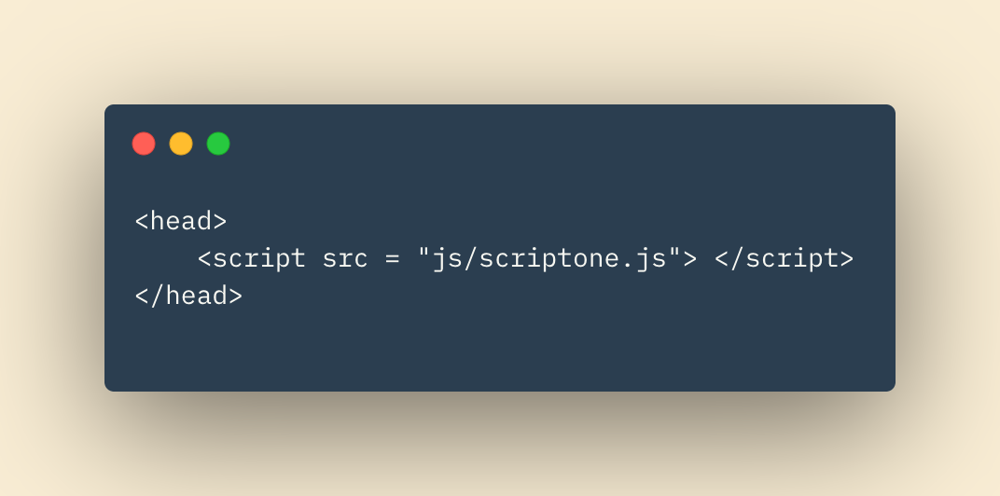

# Class01 Reading Notes

## In This Article:

[Structure](#structure)

[Extra Markup](#markup)

[HTML5 Layout](#layout)

[Process & Design](#design)

[ABC's of Programming](#abcs)

---

## Structure

Your house has *structure*.  The car you drive has *structure*.  Your research papers in high school, **this class**, all have *structure*.  A website is no different.  The pages you visit all have structure.  HTML (Hyper Text Markup Language) is the tool we use to give web pages their structure.  We use headings, paragraphs, bold texts, and other techniques to give foundation and order to our pages.  We can use 'tags' to distinguish parts of the webpage, such as the body, header, or footer.  We even use an html tag to structure the entire HTML page! 

As you can see in the code snippet above, even our code has structure.  We use indentation and spacing to organize the code and make it more readable.  It's the HTML structure to the structure of the webpage!  Get used to it.  Structure gives us organization, flow, readability, and so much more. 

---

## Extra Markup

### Evolution of HTML

There have been several versions of HTML since the first web pages graced the internet.  Each new version came equipped to handle new features and implement new code.  Web browsers, such as Google Chrome, must be updated in order to keep up with the new versions of HTML they are rendering.  Because not all browsers are updated at the same pace it is important to distinguish 'DOCTYPE' in our code.

### Doctypes

Doctype is a declaration that tells the browser which version of HTML the page utilizes.  The doctype is declared at the top of your HTML code. 

### Comments

The purposes of comments are fairly self descriptive.  With comments, the developer can leave helpful notes for themselves or future developers working on the code.  

Anything inside the comment will not be rendered by the browser.  The comment will only exist in the code for the authors to read.  Comments can help by being a reference or reminder to the developer while their noses are buried in the code.

---

## HTML5 Layout

HTML5, the most recent iteration of HTML, introduces new sets of elements to help structure the web page.   The elements replace the previously conventional way of writing HTML by using "div id" elements.  The new elements are mostly self descriptive.  They include header, footer, nav (navigation), and article elements.  

Becoming familiar witht he newest version of HTML, or any language, is imperative in being a successful developer.  Like doctors or lawyers, software developers and engineers will continually have new protocol, practices, and syntaxes to stay up to date with.  Tech is a rapidly developing field.  Anyone who refuses to adapt or stick in their way of thinking will be deservingly left behind.  

## Process & Design

Ultimately the web page you are working on is designed to serve a *purpose*.  There are some essential questions you the developer should be asking prior to implementing any design or code of a web page.  

* Who is the Site For?

Is the target audience a company?  Men or women of a specific age?  Maybe your target audience will be parents of teenagers in a specific community.  Keep your audience in mind throughout your design process!

* Why Are They Visiting Your Website?

Will the user be purchasing goods from your site?  Maybe they are looking for information on a certain topic?  How you answer these questions for your specific site will determine what and how you choose to layout your pages. 

* What Information Does Your Visitor Need?

Going back to our afformentioned examples, a user looking for information on a research topic may be looking for paragraphs of information.  Potentially these paragraphs are laid out in some kind of ordering or sectioning.  On the other hand, a user looking to purchase a bracelet from your site will require *far* less amount of information.  However, they still may require very specific information such as bracelet sizes, colorings, photos, and pricing.  

* How Often Will Your Site Be Visited?

This is an imporant question to ask when considering upkeep costs of your site.  If users are going to your site daily to check for new information on a rapidly changing topic, your site will require higher upkeep costs.  Much less so with a site who's visitors may come once a month or year. 

---
 

## ABC's of Programming

With Javascript developers can add functionality and interaction to their web pages.  If HTML is the structure & foundation, CSS the paint & decorating, then Javascript is the lighting, plumbing, and electrical.  

### What is a 'Script'?

Ease up Romeo, this isn't quite your Juliet kind of script.  Human's use recipes, manuals, or handbooks in order to accomplish certain tasks.  In Javascript, we use **scripts** to tell the computer our instructions to complete a task.  Luckily, computer's are compliant and obey our tasking.  Unluckily, computers do poor with vague instructions.  For a successful script, our coded instructions need to be thorough.  

When coming up with a script you should first define a clear goal of the script.  It should be specific and clear.  

Once a goal is established you can begin designing your script.  This doesn't have to be a bug-proofed javascript file quite yet.  You can simply write down a wireframe or blueprint of the steps in your script.  Give yourself or your team an outline of how the script will run, and what components it will have. 

Finally, code each step of your script and stick with it!  With persistance and attention to detail your script will be up and running in no time.  

### Computer's and the World Around Them

Like it or not, anything in the 'real' physical world can be represented by data.  With computers we can use collected data to develop models of the world around us.  These models may represent a hotel and tell us how many rooms are available on a given night.  Other models might use physical characteristics and traits of a baseball player in order to tell the Oakland Athletics who to draft to their team.  Possibilities are endless.  It what makes programming so exciting!  

In computer programming, **objects** are used to represent physical *things*. **Properties**, in programming, represent *characteristics* about those **objects**.  **Functions** and **methods** represent *actions* that those objects can take.  While considerably overwhelming at first, these terms and usages will make sense in due time. 

### Writing a Script

We can write scripts both imbedded within our HTML file, or in a separate Javascript file.  These separate files have a .js file extension and are linked within our HTML page.

The linked script in the example above will be referenced by the HTML page as needed. A portion of the rendering page may call a function within the linked javascript file.  Because it is linked in our HTML file, that function can be accessed.  Think of it like keeping a cookbook in your kitchen that you can reference when you want a specific recipe.  Your cookbook wouldn't be very useful if you didn't know where it was!

Nothing like some home scripting! I mean...cooking!

~ QP3

[Home](../README.md)