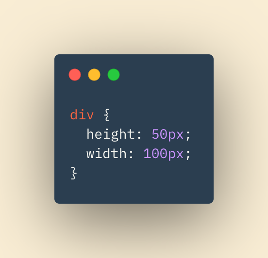
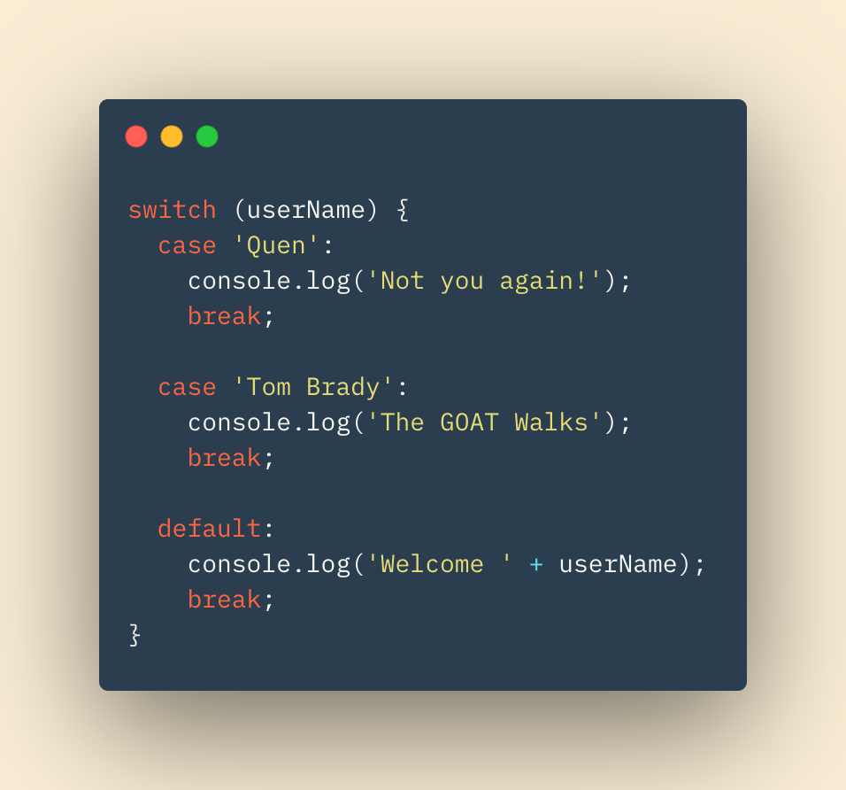
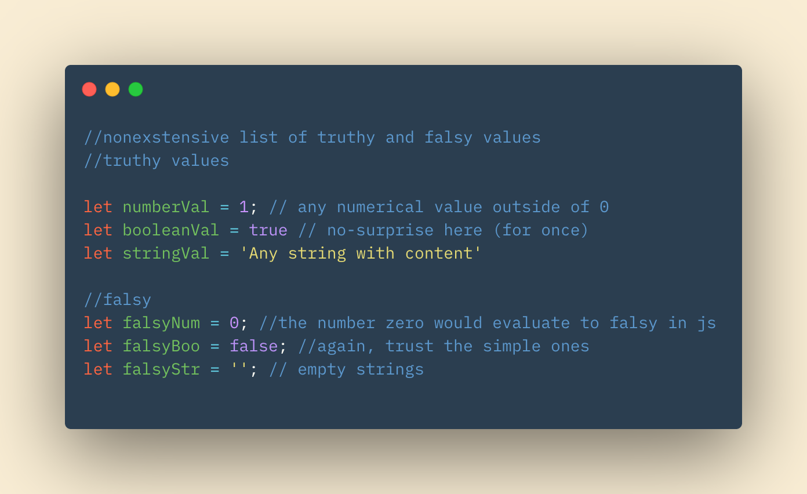

# HTML Lists, JS Control, and CSS Box!

## In this Article

[Lists](#topic1)

[Boxes](#topic2)

[Decisions & Loops](#topic3)

[Topic 4](#topic4)

---

## Lists

Lists can be useful in HTML for multiple reasons.  Lists are a clean, simple way to display certain information.  They can also add structure and variability to your web page.  

There are three types of lists utilized in HTML:

1. Ordered Lists: Use numbers for each list item

2. Unordered Lists: Use bullet points for each list item

3. Definition Lists: Used to define terminology

## Boxes

CSS treats HTML elements as if they are their own boxes.  Knowing that, we can use CSS to manipulate the sizes, dimensions, borders, margin, and padding of those boxes.  

These measurements can be written in CSS in multiple units.  Our examples will be in px (pixels).  Othe units to try and experiment with are percentages, or em, which is a size relative to the font size of the element.

### Height Width

Above is an example of assigning a specified height and width, again in pixels here, to your HTML div elements.  

### Padding Border Margin

:max_bytes(150000):strip_icc()/Padding-5ada00eb1d640400390ccf6d.jpg)

Padding border and margin will be your best friend and worst enemy when learning CSS.  **Padding** is the immediate space around your content (that is sitting inside your box).  The **border** is like the fence for your box, and the **margin** is the space *around* your box.  

Again, these properties can be adjusted just like our height and width.  Adding or removing space can help a lot in your pages layout!

## Decisions and Loops

If statements, loops, and the like are ways of controlling flow in our code.  They give branches for the code to take, similar to a flow chart.

### Switch Statements

**Switch** statements begin with the kewywod **switch** followed by a variable called the switch value.  Following this opening will be curly brackets.  Inside the brackets are **cases**. Each case represents a possible value for the initial variable in our opening.  If that variable matches on of the case values, then that case's code block is run.

In the switch statement above, userName will be checked against each case.  Depending on what userName points to as a value, a different case will be run!  The default case will be run if no other case matches.

### Truthy Falsy

Every value in javascript can be evaluated as **truthy** or **falsy**.  While true and false can be confusing enough when we talk logical operators and statements, understanding truthy falsy is important. Truthy and falsy values are shown in our code below.

> Note: These are not strictly equal to.  In otherwords, if you checked their values against true or false with double-equals (==) then these values would be correct. If you strictly checked them (===) then these values would not be correct.  

### Loops

Loops check a condition. If the condition evaluates to True, then the loop will continue to cycle.  If and when the condition evaluate to False, the loop is exited and the code can continue.

**For Loop**

The keyword in a for loop is none other than *for*. In a for loop, we use an initialized variable, often 'i', to determine how many times the loop will run.  We then give a condition involving our variable 'i' to be evaluated.  When it returns False, the loop is exited.  

Each iteration of the loop we can tell the code to add 1 to 'i'.  We can tell it to do any process to 'i', but incrementing it by 1 is the most common.  We call this *updating* the variable. 

**While Loop**

A while loop simple has a condition and is run until that condition evaluates to True.  The keyword *while* is used to use a *while* loop.  The condition will be followed by opening and closing curly braces.  

The lines within the braces will be run until the initial condition is evaluated False.  At that time, the loop will exit and the code will continue on.  
~ QP3

[Home](../README.md)

Information put into my own words came from *Javascript and JQuery* by J Duckett
