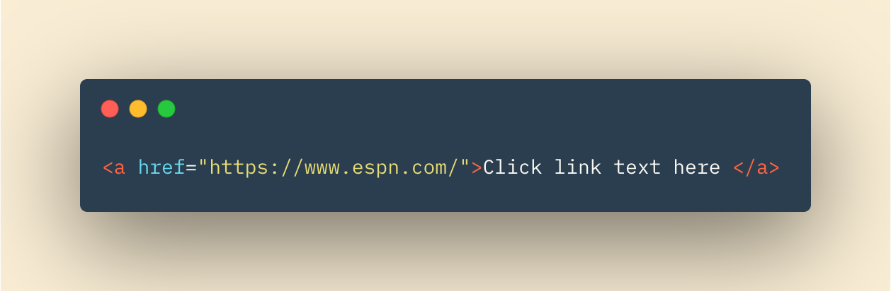
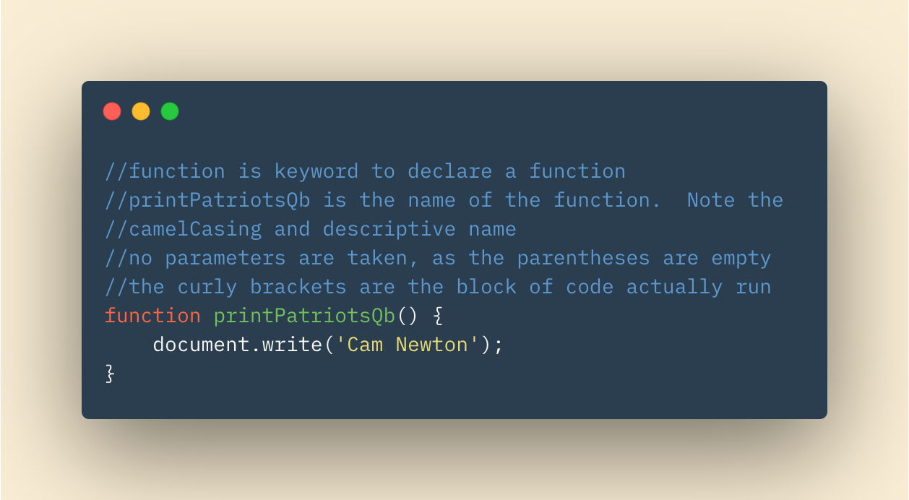
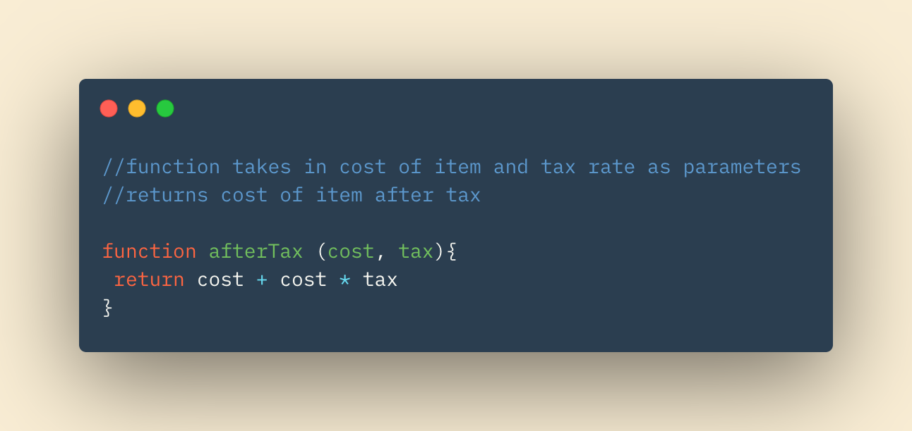
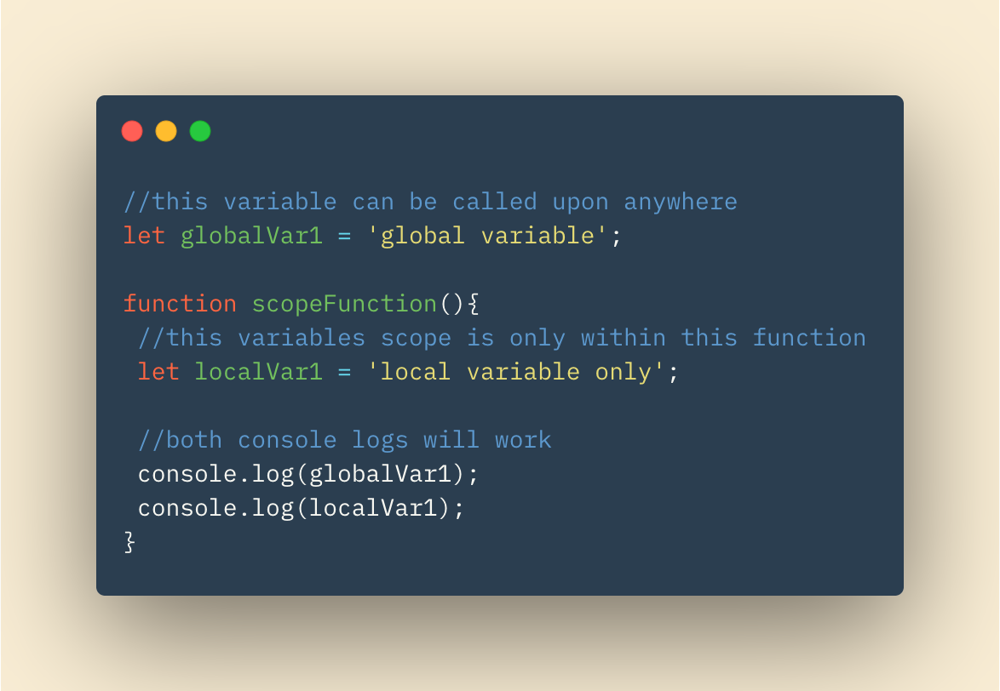

# Links, Layouts, Functions and Pair Programming

## In this Article

[Links](#topic1)

[Layouts](#topic2)

[Functinos & Methods](#topic3)

[Pair Programming](#topic4)

---

## Links

Links in HTML are inserted using the **< a >** element.  Between your opening and closing < a > tags, you can write anything you'd like.  This text will appear on your rendered webpage and will be what is "clicked" for your link.  Inside your opening < a > tag is where you will put the **href** attribute.  The value of href will be the address of the site or page you are linking!

Links can be used in lists, your navigation bar, or right in-line of your text.  

When linking to a page on the same site, you do not need to include the full URL in the href.  Instead, you can use the relative URL.  Depending on how your files are organized, this may look different.  For example, if all of your files are in the same folder, then your relative URL will simply be the name of the file/page you are linking to.  If moving to parent or child folders, your relative URL must include that information.  Moving to parent or grandparent folders is done with two periods followed by a forward slash.  Moving in the other direction to child folders is done by simply naming the folder and following it with a forward slash.  

## Layouts

HTML layout using CSS is useful for creating professional, appropriately organized web pages.  We have talked about how CSS treats elements of HTML as if they are in boxes.  There are two display types: block-level elements, and inline elements.  Block level elements start a new line with each new block element.  In-line elements are placed within the flow of elements and content around them.  

HTML elements essentially sit inside their own *container*.  If the parent container around them is manipulated, then everything inside that parent container will be manipulated as well.  We would have to specify more specifically the child containers if we wanted to move or rearrange them without distrubing other elements.  

There are mutltiple ways to position elements on our page. 

* **Relative Positioning** - *Moves content relative to where it would be in normal flow.  Does not affect surrounding element's positions*

* **Absolute Positioning** - *Moves elements in relation to their containing elements.  Move as the user scrolls up and down the page*

* **Fixed Positioning** - *Elements placed in relation to the window.  Do not move as the user scrolls up and down*

* **Float** - *Content will wrap around floated elements. Floated elements become block level.*

## Functions

Functions allow developers to group specific sets of instructions into a contained, reusable script of code.  Functions, once declared, can be called repeatedly and through a program at very little additional cost.  Once the function is written once, it takes a simple call statement to run again.  

The keyword *function* is used when declaring a function.  This is followed by the *name* of the function.  Optionally, parenthesis can contain *parameters* to be used in the function, but these are not required.  If not used, the parentheses will be empty. Lastly, the curly brackets follow and are the block of code that the function actually runs.  

Functions can return values as output.  This returned value can be used in another function, printed, logged, or whatever the script calls for! We might want a function to calculate tax for us.  We would want the function to return the total cost of an item, after tax.  An example of that function, with a return statement, is below. 

### Variable Scope

Lastly, we will talk about variable scope.  Where a variable is declared affects where that variable can be called upon. A variable declared inside of a function can only be called inside that specific variable.  The **scope** of it is local.

Alternatively, a variable declared outside of a function has a **global** scope, and can be called and used inside of any function, in addition to the local variables that function may have.  

## Pair Programming

**Pair programming** is a technique used in the industry to instantaneously get feedback, review, erroe checking, and more from our peers. A pair of programmers will commonly share a workspace to tackle a coding issue as a team.  In not only encourages community, teammwork, and communication, but also helps to improve your software skills.  All of which are goals of our learning.  

1. Driver - Only one who has hands on the keyboard.

2. Navigator - Uses words to 'drive' the driver, but is not hands on with the computer.  Should not be writing code.

Don't forget to tell your job interviewer that this is an 'agile' practice. These practices will also help developers at becoming confident in talking about code *out loud* which is important especially for junior developers.  

Additional benefits of paired progamming incldue:

* Greater Efficiency

* Engaged Collaboration

* Learning from Peers

* Social Skills

* Job Interview Readiness

* Work Environment Readiness

~ QP3

[Home](../README.md)

Information put into my own words came from *CSS & HTML* and *Javascript & JQuery* by J Duckett
Additional information from *6 Reasons for Pair Programming* by Allie Grampa
