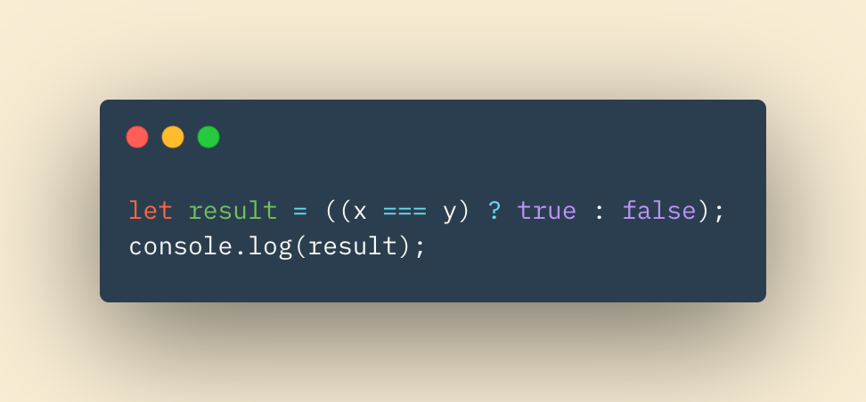

# Main Head

## In this Article

[Reat Forms](#topic1)

[Ternary Operator](#topic2)

[Topic 3](#topic3)

---

## React Docs - Forms

1. What is a ‘Controlled Component’?

A *controlled component* is a technique in react used to control data. In the case of a form, who's data is normally maintained by their HTML elements, a controlled component is used to make React handle the data. In other words, the react state that is set is the 'truth' in what the data is. Basically we are manually controlling the data with React instead of leaving it up to the HTML elements responsibility.

2. Should we wait to store the users responses from the form into state when they submit the form OR should we update the state with their responses as soon as they enter them? Why.

Their responses should be saved each time a change has been comitted.  I.e. eah key stroke will update the state.  This prevents loss of form data and can make the page more responsive depending on the users selections. 

3. How do we target what the user is entering if we have an event handler on an input field?

With the *onChange = {this.handlechange}* inside of the component's form elements.

## Ternary Operators

1. Why would we use a ternary operator?

Ternary operators are a much cleaner, simpler way of writing if..else statements. The cleaner syntex means higher readability and less room for mistakes.

2. Rewrite the following statement using a ternary statement:

## Thins I Want to Know More About

1. What is the *.bind* function?

~ QP3

[Home](../README.md)

Information put into my own words came from *Book Title* by J Duckett
