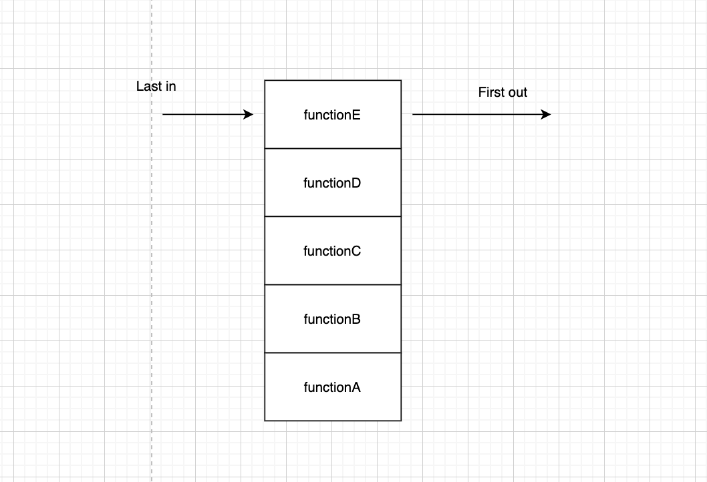

# In Memory Storage

## In this Article

[Javascript Call Stack](#topic1)

[Javascript Error Messages](#topic2)

---

## Understanding Javascript Call Stack

1. What is a ‘call’?

A call is a single function invocation. 

2. How many ‘calls’ can happen at once?

One call can happen at once. The stack is synchronous.

3. What does LIFO mean?

Last in, first out. Like making a stack of cookies. The last cookie placed on the stack will be on the top, and thus the first one grabbed when you're hungry. 

4. Draw an example of a call stack and the functions that would need to be invoked to generate that call stack.

5. What causes a Stack Overflow?

When there is a recursive function that calls itself, without an exit point. 

## Javascript Error Messages

1. What is a ‘refrence error’?

Your code is referencing a variable or function that has not been declared.

2. What is a ‘syntax error’?

Improper use of syntax that results in the code not being parsed correctly. 

3. What is a ‘range error’?

Accessing an array at an index that does not exist, in that given array.

4. What is a ‘type error’?

Trying to use or access a number, string, etc. but it is incompatible with what you are trying to perform.

5. What is a breakpoint?

A breakpoint is set at a location in your code that you wish to examine. The breakpoint will pause the code at that point, where you can then look at what is happening and the state of your code.

6. What does the word ‘debugger’ do in your code?

It is another way of setting a breakpoint for debugging purposes. 

~ QP3

[Home](../README.md)

Information put into my own words came from *https://www.freecodecamp.org/news/understanding-the-javascript-call-stack-861e41ae61d4/* and *https://codeburst.io/javascript-error-messages-debugging-d23f84f0ae7c*
