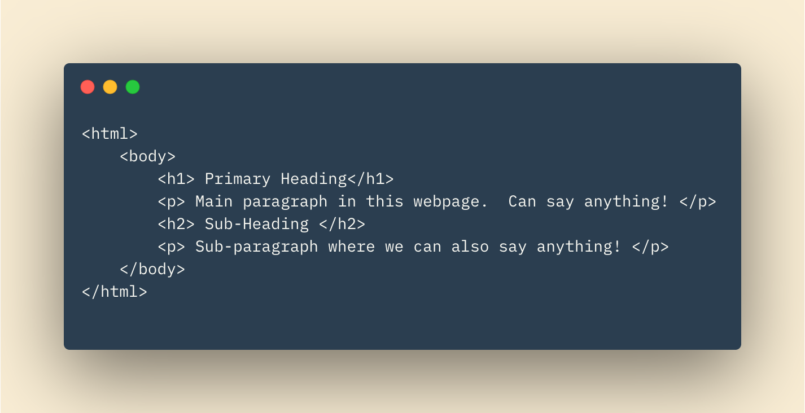
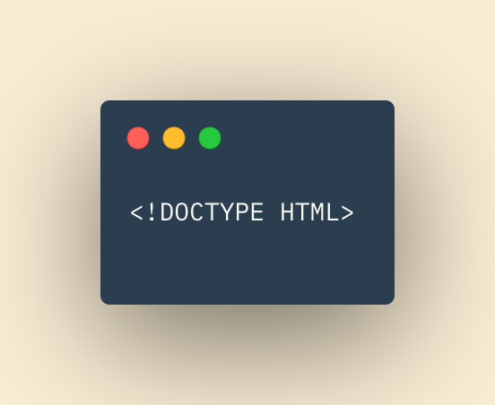
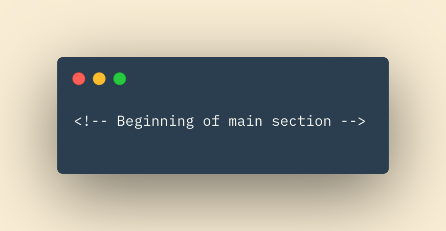

# Class01 Reading Notes

## Structure

Your house has *structure*.  The car you drive has *structure*.  You research papers in high school, **this class**, all have *structure*.  A website page is no different.  The pages you visit all have structure.  HTML (Hyper Text Markup Language) is the tool we use to give web pages their structure.  We use headings, paragraphs, bold texts, and other techniques to give the foundation to our pages.  We can use 'tags' to distinguish parts of the webpage, such as the body, header, or footer.  We even use an html tag to structure the entire HTML page! 

As you can see in the code snippet above, even our code has structure.  It's the structure to the structure of the webpage!  Get used to it.  Structure gives us organization, flow, readability, and so much more.  Structure is the foundation to everything else we hope to accomplish with our project. 

## Extra Markup

### Evolution of HTML

Since the first web page there have been several versions of HTML.  Each new version was able to implement new code.  Web browsers, such as Google Chrome, must be updated in order to keep up with the new versions of HTML they are rendering.  Because not all browsers are updated at the same pace, and overlapping HTML iterations, it is important to distinguish 'DOCTYPE' in our code.

### Doctypes

Doctype is a declaration that tells the browser which version of HTML the page utilizes.  The doctype is declared at the top of your HTML code. 

### Comments

Comments purposes are self descriptive.  With comments, the developer can leave helpful notes for themselves or future developers working on the code.  

Anything inside the comment will not be rendered by the browser.  The comment will only exist in the code for the authors to read.  

## HTML5 Layout

HTML5, the most recent iteration of HTML, introduces new sets of elements to help structure the web page.   The elements replace the previously conventional way of writing HTML by using "div id" elements.  The new elements are mostly self descriptive.  They include header, footer, nav (navigation), and article elements.  

Becoming familiar witht he newest version of HTML, or any language, is imperative in being a successful developer.  Like doctors or lawyers, software developers and engineers will continually have new protocol, practices, and syntaxes to stay up to date with.  Tech is a rapidly developing field.  Anyone who refuses to adapt or stick in their way of thinking will be deservingly left behind.  

## Process & Design

Ultimately the web page you are working on is designed to serve a *purpose*.  There are some essential questions you the developer should be asking prior to implementing any design or code of a web page.  

1. Who is the Site For?

Is the target audience a company?  Men or women of a specific age?  Maybe your target audience will be parents of teenagers in a specific community.  Keep your audience in mind throughout your design process!

2. Why Are They Visiting Your Website?

Will the user be purchasing a good from your site?  Maybe they are looking for information on a topic?  How you answer these questions for your specific site will determine what and how you choose to layout your pages. 

3. What Information Does Your Visitor Need?

Going back to our afformentioned examples, a user looking for information on a research topic may be looking for paragraphs of information.  Potentially these paragraphs are laid out in some kind of ordering or sectioning.  On the other hand, a user looking to purchase a bracelet from your site will require *far* less amount of information.  However, they may require very specific information. Possibly bracelet sizes, colorings, photos, and pricing.  

4. How Often Will Your Site Be Visited?

This is an imporant question to ask when considering upkeep costs of your site.  If users are going to your site daily to check for new information on a rapidly changing topic, your site will require higher upkeep costs.  Much less so with a site who's visitors may come once a month or year. 

## ABC's of Programming

~ QP3

[Home](README.md)