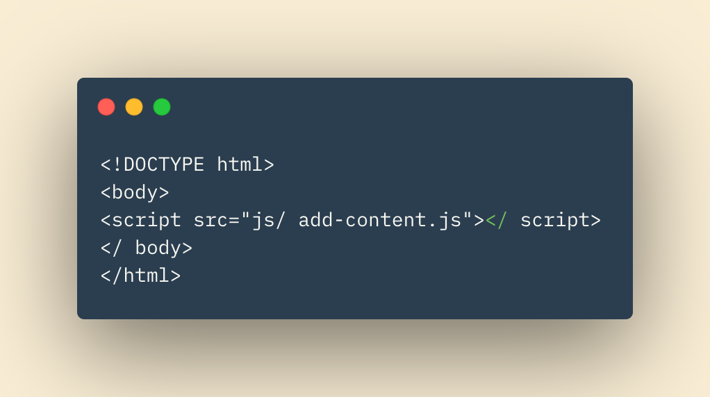
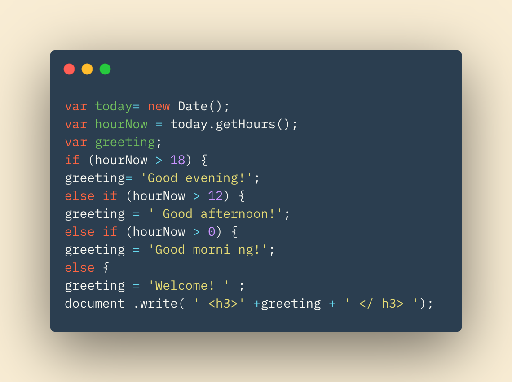
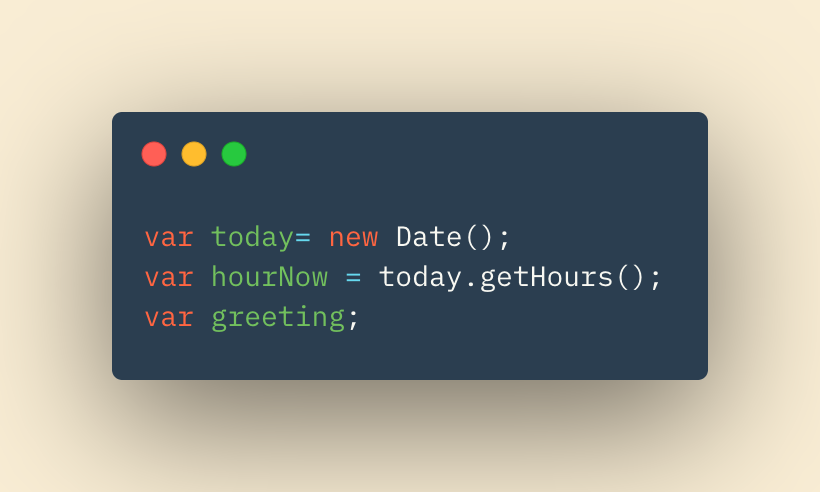
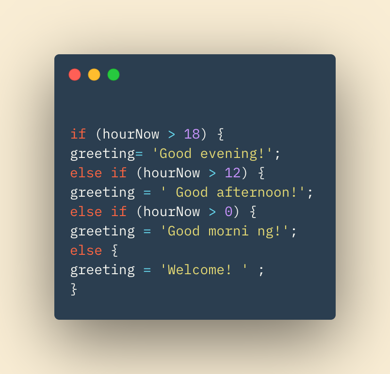
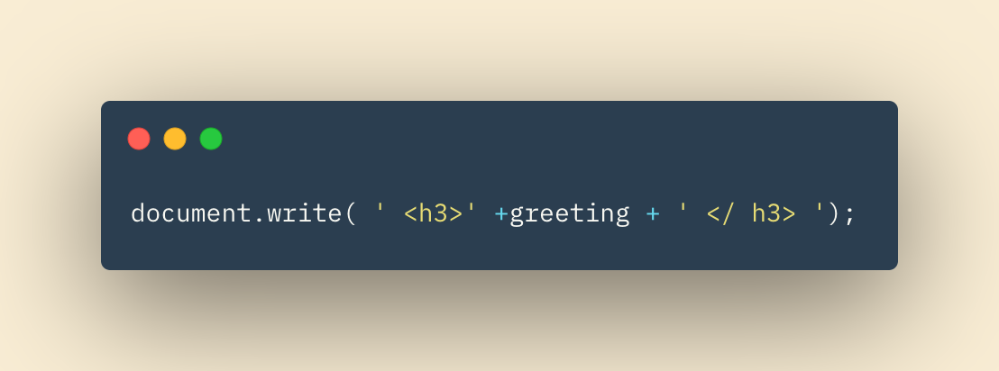

### Gettting Slipt with Javascript

Javascript finally turns the lights on in the house that HTML and CSS built.  Javascript is the central air, clap-on-off lighting, water heater, and everything else that adds '*functionality*'.

We can link our javascript file via a script tag in our HTML.

Once linked, we can use our Javascript file to  access and manipulate our HTML file.  

Let's look at a basic javascript file and break it down!

## Variables
The first three lines of code declare '*variables*'.  Variables *store* value locations.  Behind the scenes when a variable is called, the program looks to the variables location (in memory) and what value is stored there.  That value is then used in the program and the script continues.  

Variables can store data types, and can be changed.  Integers (numbers), Strings (written letters), or Boolean (True or False) values can all be stored and used in variables.  

## If, Else if Statement

The next segment of code is our '*if statement*.

The block starts off with a simple 'if'.  This gives the program, again behind the scenes, some issues to work out.  The result of this code can be thought of like a flow chart.  Each line of 'if' and 'else if' is a fork in that flow chart or tree.  You, or the program in this case, can only go one way or the other.  Luckily, computers don't have indecision!

'hourNow' in the first line is a variable that we spoke about earlier.  We assigned a value to it in the second line of the code.  The program will check the value that is stored in it, and see if it is greater than the integer 18.  If it is, the 'greeting' variable we declared in line 3 will hold the String value of 'Good Evening'.  If the comparisoin returns False, the program will scip the first code within the curly brackets and move to the next 'else if' statement.

The program will continue with it's comparisons of hourNow to the given number until the expression evaluates to True.  If True is never returned, the final 'Else' statement will set the default value for our greeting variable.

## The Final Line

We've made it to the final line of code.  The work isn't done, and if this line isn't correct then each perfectly written line before this is meaningless to the program.  

Lets break this down.  Being familiar with HTML, we should somewhat recognize what's going on inside the parenthesis.  H3 tags are sandwiching our greeting variable, which at this point we should know holds a string value (which string value exactly will depend on the time of day the program is run).

So how is the programming adding this line of HTML to the HTML file its linked in?

Without getting too far into the weeds, as this is an introductory article, the 'document' is an object.  Objects have methods they can perform.  In this case, the method is 'write'.  Notice the '.' after 'document' and before 'write'  This indicates we are accessing a method of the object.

Agaun, without thinking about it *too* much, the document is now able to write into our HTML code!  It writes exactly what is in the parentheses.  Thus, we are successfully adding and opening and closing < h3 > tag, with a message inside it.  Once this is in the HTMl file, it will be displayed just as if we had written this into the HTML file on our own.  

---

## Closing thoughts and pointers

### Infinite Approaches

* There is no one way to solve a problem in JS.  We gave one example here, just know you will see many other ways, techniques, and types of logic.  

### Growth Mindset!

* Do not forget your growth mindset.  This is an entirely knew way of thinking.  If you can absorb just one piece each day, after a year people will be willing to pay you for your skills.

### Don't Think Too Hard

* Behind the scenes logic can seem foreign.  Do you know how your heart beats?  Do you fully understand every step for how your brain tells your legs to walk?  Or at some point do you accept these processes and use them to your benefit?  The same idea applies here, at least for now.  

~QP3